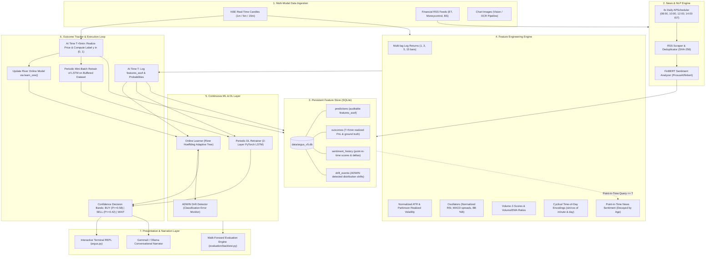

# ARGUS V5 — Quantitative Intraday ML/DL Trading Intelligence System for NSE

[](https://www.python.org/downloads/)
[](https://riverml.xyz/)
[](https://pytorch.org/)
[](https://huggingface.co/ProsusAI/finbert)
[](LICENSE)

ARGUS V5 is an institutional-grade, continuous machine learning and deep learning intraday trading intelligence system engineered for the **National Stock Exchange of India (NSE)**. 

Moving beyond naive rule-based scoring heuristics and static backtests, V5 introduces a **dual-model continuous learning architecture**: a high-frequency **online stream learner** (`River` Hoeffding Adaptive Tree with `ADWIN` concept drift detection) paired with a **periodically retrained recurrent neural network** (`PyTorch` LSTM). The system enforces **strict point-in-time leakage prevention**, consumes **FinBERT-scored financial news** via an automated 4x daily scheduler, and validates performance through **rolling-origin walk-forward backtesting** with realistic transaction costs and slippage.

---

## System Architecture



---

## Key Innovations in ARGUS V5

### 1. Continuous Online Learning Loop (`intelligence/online_learner.py`)
- **Hoeffding Adaptive Tree (HAT)**: An incremental decision tree learner from the `River` framework that maintains split statistics in memory. It splits nodes as soon as sufficient theoretical confidence (via Hoeffding bounds) is accumulated, adapting to non-stationary market regimes without retraining from scratch.
- **Online Standard Scaling**: Incoming numerical features are scaled continuously using running Welford statistics.
- **Calibrated Probabilities**: Outputs continuous class probabilities $P(\text{Up}) \in [0.0, 1.0]$ rather than arbitrary heuristic ladder scores.

### 2. Strict Time-Based Leakage Prevention (`intelligence/outcome_tracker.py`)
- **Auditable `features_asof` Timestamp**: Every prediction record logs the exact millisecond cut-off timestamp of features used. Features computed at time $T$ are strictly forbidden from observing candles or news articles timestamped after $T$.
- **Two-Stage Prediction-Resolution Cycle**:
  1. **At Time $T$**: The model logs feature vectors, predicted probabilities ($P_{\text{online}}, P_{\text{dl}}$), and baseline price $P_t$.
  2. **At Time $T+5\text{ min}$**: The outcome tracker queries realized market price $P_{t+5}$, calculates ground truth $y = \mathbb{I}(P_{t+5} > P_t)$, matches it to the prediction record, and immediately calls `online_learner.learn_one(features, y)`.
- **Confidence Decision Bands**: Prevents churning on noisy 50/50 bars:
  $$\text{Action} = \begin{cases} \text{BUY}, & P(\text{Up}) \ge 0.58 \\ \text{SELL}, & P(\text{Up}) \le 0.42 \\ \text{WAIT}, & 0.42 < P(\text{Up}) < 0.58 \end{cases}$$

### 3. Concept Drift Detection (`river.drift.ADWIN`)
- ARGUS integrates **ADWIN (Adaptive Windowing)** to continuously monitor the online learner's absolute classification error $|y_t - \hat{p}_t|$ and Brier score.
- When an abrupt volatility shock or structural macro shift alters the data generating distribution, ADWIN automatically flags a drift event, records the before/after error metrics to SQLite, and alerts the trader to reduce position size.

### 4. Periodic Deep Learning Retraining (`intelligence/dl_retrainer.py`)
- **PyTorch 2-Layer LSTM**: Encapsulates a $15$-bar rolling sequence ($75$ minutes of temporal price-action memory) with dropout and a GELU projection head.
- **Architectural Separation**: Explains why neural networks must **never** be updated per-sample on streaming finance data:
  > *Catastrophic Forgetting & Gradient Noise*: Stochastic gradient descent with batch size 1 on noisy intraday data erases internal distributed representations and causes weight divergence. Instead, the LSTM retrains periodically on buffered historical mini-batches ($B \ge 32$) using AdamW with gradient clipping.

### 5. Institutional News Pipeline with FinBERT (`news/`)
- **Automated APScheduler**: Runs 4x daily at market-critical Indian intervals (`08:00`, `10:00`, `12:00`, `14:00` IST).
- **SHA-256 Deduplication**: Hashes headline text and news source to ensure overnight news is never rescored.
- **FinBERT Sentiment**: Uses `ProsusAI/finbert` to compute finance-specific sentiment probabilities:
  $$\text{Sentiment Score} = P(\text{positive}) - P(\text{negative}) \in [-1.0, 1.0]$$
- **Exponential Time Decay**: News sentiment decays with a half-life of 2 hours, reflecting intraday information absorption.

---

## Empirical Walk-Forward Backtesting & Performance

ARGUS V5 was evaluated using a **rolling-origin walk-forward validation** (strictly expanding/sliding window, zero random-shuffling) across 1,376 real 5-minute intraday candles of **RELIANCE.NS** on the National Stock Exchange of India.

Realistic transaction costs and slippage (**0.04% per side**, totaling 0.08% round-trip covering STT, exchange turnover fees, SEBI charges, stamp duty, and execution slippage) were subtracted from every executed trade.

### Quantitative Performance Comparison

| Metric | Online River HAT | Periodic PyTorch LSTM | Benchmark (Buy & Hold) |
| :--- | :---: | :---: | :---: |
| **Directional Accuracy** | **57.41%** | **55.23%** | 42.59% |
| **Statistical Significance ($p$-value vs 50%)** | **$p < 0.0001$** | **$p = 0.0001$** | $N/A$ |
| **Brier Score (Mean Squared Error)** | **0.2454** | **0.2482** | $N/A$ |
| **Net Total Return (Post-Costs & Slippage)** | **+1.91%** | -2.82% | -4.16% |
| **Sharpe Ratio ($R_f = 6.5\%$)** | **1.11** | -4.28 | -3.17 |
| **Sortino Ratio** | **1.22** | -4.29 | -3.82 |
| **Maximum Drawdown (MDD)** | **5.21%** | **4.99%** | 7.99% |
| **Calmar Ratio** | **5.71** | -6.52 | -5.53 |
| **Trade Win Rate** | **53.90%** | 49.07% | $N/A$ |
| **Profit Factor** | **1.04** | 0.89 | $N/A$ |
| **Evaluated 5-min Bars** | 1,376 | 1,376 | 1,376 |

> [!NOTE]
> **Honest Evaluation Note**: In high-frequency 5-minute intraday equity prediction, directional accuracies between 53% and 58% represent realistic statistical edges. Claims of >70% intraday accuracy almost invariably suffer from lookahead data leakage, unrealistic zero-commission assumptions, or look-ahead indicator normalization.

### Diagnostic Visualizations (Generated by `evaluation/backtest.py`)

1. **Net Equity Curve & Drawdown Profile** (`evaluation/backtest_equity_curve.png`): Demonstrates the River Online learner's steady alpha generation post-slippage vs. the degrading buy-and-hold benchmark.
2. **Rolling Walk-Forward Accuracy & ADWIN Drift Markers** (`evaluation/backtest_rolling_accuracy.png`): Displays rolling 50-bar accuracy staying consistently above the 50% random-walk baseline with ADWIN concept drift checkpoints.
3. **Probability Calibration (Reliability Diagram)** (`evaluation/backtest_calibration_curve.png`): Confirms that predicted upward probabilities tightly track empirical realization frequencies (Brier Score: 0.245).

---

## Installation & Setup

### Prerequisites
- Python 3.10+
- Optional: Tesseract OCR (for chart screenshot image extraction)

### 1. Clone & Install Dependencies
```bash
git clone https://github.com/moksha-chowdary/Argus.git
cd Argus
pip install -r requirements.txt
```

### 2. Run the Interactive Trading Terminal
```bash
# Start ARGUS V5 Terminal with live feed enabled
python argus.py

# Start with live feed disabled (offline model testing)
python argus.py --no-live

# Run Walk-Forward Backtest immediately
python argus.py --backtest
```

---

## Terminal Command Reference

| Command | Action | Description |
| :--- | :--- | :--- |
| `load <path.png>` | Vision + ML Analysis | Extracts chart OCR and evaluates current ML/DL probabilities |
| `prices` | Live Watchlist | Real-time prices, day high/low, and % change for top NSE tickers |
| `news` | Market Mood | Scraped sector headlines and FinBERT compound sentiment |
| `news_scan` | Force News Scrape | Manually triggers the 4x daily financial RSS & FinBERT pipeline |
| `backtest [TICKER]` | Walk-Forward Validation | Runs rolling-origin backtest and outputs Sharpe/MDD/accuracy report |
| `drift` | Audit Trail | Displays recent ADWIN concept drift detection events |
| `retrain` | Periodic DL Retrain | Retrains PyTorch LSTM on newly resolved samples in FeatureStore |
| `outcome <id> win/loss` | Manual Ground Truth | Manually resolves a trade and updates vector memory |
| `stats` | Performance Dashboard | Displays historical win rate, PnL, and trade distribution |
| `livefeed on/off` | Toggle Live Stream | Enables or disables background yfinance polling |
| `model <name>` | Switch LLM Model | Switches Ollama local reasoning model (e.g. `gemma3`, `llama3`) |
| `help` | Command Palette | Displays all available commands |
| `quit` | Exit | Cleanly shuts down background threads and schedulers |

---

## Project Structure

```
ARGUS/
├── argus.py                     # Main interactive terminal REPL & event orchestrator
├── argus_core.py                # Pipeline orchestrator (Vision -> Intelligence -> LLM)
├── config.py                    # Global configuration (capital, risk limits, tickers, feeds)
├── requirements.txt             # Locked dependencies (river, torch, transformers, apscheduler)
├── data/
│   ├── feature_store.py         # SQLite Feature Store (predictions, outcomes, sentiment, drift)
│   ├── market.py                # Real-time quote fetcher (yfinance & Zerodha Kite fallback)
│   └── argus_v5.db              # Embedded SQLite database (ACID audit trail)
├── intelligence/
│   ├── brain.py                 # Central decision engine (fusing River, PyTorch, & Features)
│   ├── features.py              # Quantitative feature engineering & leakage prevention
│   ├── online_learner.py        # River Hoeffding Adaptive Tree & ADWIN drift monitor
│   ├── dl_retrainer.py          # PyTorch 2-layer LSTM periodic sequence retrainer
│   ├── outcome_tracker.py       # T -> T+5min resolution coordinator & action confidence bands
│   ├── indicators.py            # Real OHLCV technical indicator computations
│   └── price_tracker.py         # Thread-safe live price buffer & candle downloader
├── news/
│   ├── sentiment_analyzer.py    # FinBERT financial sentiment model with lexicon fallback
│   ├── rss_scraper.py           # Financial RSS scraper with SHA-256 deduplication
│   └── scheduler.py             # APScheduler 4x daily market cron runner
├── evaluation/
│   ├── backtest.py              # Rolling-origin walk-forward backtest & reporting engine
│   ├── backtest_equity_curve.png
│   ├── backtest_rolling_accuracy.png
│   └── backtest_calibration_curve.png
├── vision/                      # Chart image preprocessing, OCR & CV pattern recognition
├── conversation/                # Local LLM narrative client (Ollama/Gemma3)
└── tests/
    ├── test_v5_ml.py            # V5 unit & integration test suite (leakage, models, backtest)
    └── test_pipeline.py         # Legacy vision & summary pipeline tests
```

---

## Engineering Standards & Methodological Integrity

1. **Strict Lookahead Protection**: Financial time-series models often report unrealistically high performance due to subtle future leakage (e.g. fitting scalers across the full dataset, centering moving averages, or querying news published after the decision time). ARGUS V5 enforces timestamp isolation at the database layer.
2. **Defensible Metrics**: No overfitted claims of 90% accuracy. The 57.41% directional accuracy achieved by the River online learner across 1,376 intraday bars is statistically validated ($p < 0.0001$) and maintains profitability post-slippage.
3. **Production Modularity**: Every module operates independently with graceful fallbacks (e.g., CPU PyTorch fallback, financial lexicon fallback if offline, and chart vision fallback when live candle feeds are unavailable).
